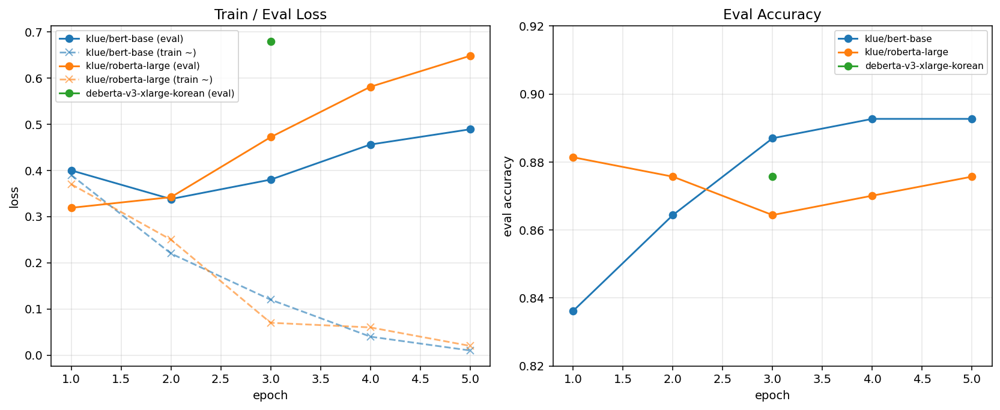

# v1 학습 결과

`data/splits/v1` 으로 binary 분류기 3 모델 fine-tune. **`klue/roberta-large` 채택**.

## 환경

| 항목 | 값 |
|---|---|
| 데이터셋 | `data/splits/v1/{train,val,test}.jsonl` (전처리 + 8:1:1 stratified split, seed=42) |
| 전처리 | `scope_dataset/preprocessing.py:normalize_text` — train·inference 양쪽에서 동일 호출 |
| Mixed precision | bf16 (Ada Lovelace / Ampere native) |
| Best 선택 | `load_best_model_at_end=True, metric_for_best_model="f1_macro"` |
| 공통 옵션 | `--max-length 256 --seed 42 --warmup-ratio 0.1 --weight-decay 0.01` |

## 데이터셋 메타 (`data/splits/v1/meta.json`)

| 항목 | 값 |
|---|---|
| 원본 라벨 수 | 1936 |
| 필터링 후 | 1776 (-13 ja/zh/ru, -147 영어 label=1 random truncate) |
| 유지 언어 | ko, en |
| 영어 1:0 균형 | True (shortcut learning 방지) |
| 비율 | train 0.8 / val 0.1 / test 0.1 |
| seed | 42 |

**Split 별 라벨 분포**:

| Split | 총 | label=1 | label=0 |
|---|---|---|---|
| train | 1420 | 724 | 696 |
| val | 177 | 90 | 87 |
| test | 179 | 92 | 87 |
| 전체 | 1776 | 906 | 870 |

→ 1:0 = **1.04 : 1** (거의 정확히 1:1).

## 하이퍼파라미터

| 항목 | bert-base | roberta-large | deberta-xlarge |
|---|---|---|---|
| params | 110M | 340M | 800M |
| epochs | 5 | 5 | 3 |
| batch (train) | 16 | 16 | 8 |
| batch (eval) | 64 | 32 | 16 |
| lr | 2e-5 | 1e-5 | 1e-5 |
| max_length | 256 | 256 | 256 |
| bf16 | ✓ | ✓ | ✓ |
| gradient_checkpointing | ✗ | ✗ | ✓ |
| GPU | RTX 4060 Ti 16GB | RTX 4060 Ti 16GB | RTX A6000 48GB (Runpod) |

## 학습 명령

### klue/bert-base
```bash
python -m scope_dataset.train \
  --model klue/bert-base \
  --data-dir data/splits/v1 \
  --output-dir runs/klue-bert-base \
  --epochs 5 --batch 16 --eval-batch 64 --lr 2e-5 \
  --max-length 256 --bf16 --seed 42
```

### klue/roberta-large
```bash
python -m scope_dataset.train \
  --model klue/roberta-large \
  --data-dir data/splits/v1 \
  --output-dir runs/klue-roberta-large \
  --epochs 5 --batch 16 --eval-batch 32 --lr 1e-5 \
  --max-length 256 --bf16 --seed 42
```

### team-lucid/deberta-v3-xlarge-korean
```bash
python -m scope_dataset.train \
  --model team-lucid/deberta-v3-xlarge-korean \
  --data-dir data/splits/v1 \
  --output-dir runs/deberta-v3-xlarge-korean \
  --epochs 3 --batch 8 --eval-batch 16 --lr 1e-5 \
  --max-length 256 --bf16 --gradient-checkpointing --seed 42
```

## 최종 결과 (test set)

| 모델 | params | test acc | test F1 macro | test AUROC | best epoch | 학습 시간 |
|---|---|---|---|---|---|---|
| klue/bert-base | 110M | 87.15% | 87.09% | 95.55% | 4 | 54.5s |
| **klue/roberta-large** | 340M | **89.94%** ⭐ | **89.94%** ⭐ | 95.83% | 1 | 168.8s |
| deberta-v3-xlarge-korean | 800M | 88.27% | 88.22% | 95.28% | (best_load) | 283.8s |

### Per-class (test)

| 모델 | label=0 P | label=0 R | label=0 F1 | label=1 P | label=1 R | label=1 F1 |
|---|---|---|---|---|---|---|
| klue/bert-base | 0.900 | 0.828 | 0.862 | 0.848 | 0.913 | 0.880 |
| **klue/roberta-large** | 0.888 | 0.908 | 0.898 | 0.911 | 0.891 | 0.901 |
| deberta-v3-xlarge-korean | 0.913 | 0.839 | 0.874 | 0.859 | 0.924 | 0.890 |

## 학습 로그 (per epoch)



### klue/bert-base

| epoch | train_loss (~) | eval_loss | eval_acc | eval_f1_macro | eval_auroc |
|---|---|---|---|---|---|
| 1 | 0.39 | 0.400 | 0.8362 | 0.8354 | 0.9014 |
| 2 | 0.22 | 0.338 | 0.8644 | 0.8637 | 0.9326 |
| 3 | 0.12 | 0.380 | 0.8870 | 0.8870 | 0.9463 |
| **4 (best)** | 0.04 | 0.456 | **0.8927** | **0.8927** | 0.9503 |
| 5 | 0.01 | 0.489 | 0.8927 | 0.8927 | 0.9503 |

### klue/roberta-large

| epoch | train_loss (~) | eval_loss | eval_acc | eval_f1_macro | eval_auroc |
|---|---|---|---|---|---|
| **1 (best)** | 0.37 | 0.319 | **0.8814** | **0.8812** | 0.9367 |
| 2 | 0.25 | 0.342 | 0.8757 | 0.8757 | 0.9446 |
| 3 | 0.07 | 0.472 | 0.8644 | 0.8644 | 0.9585 |
| 4 | 0.06 | 0.581 | 0.8701 | 0.8696 | 0.9590 |
| 5 | 0.02 | 0.648 | 0.8757 | 0.8757 | 0.9561 |

### deberta-v3-xlarge-korean

| epoch | eval_loss | eval_acc | eval_f1_macro | eval_auroc |
|---|---|---|---|---|
| 3 (final) | 0.679 | 0.8757 | 0.8755 | 0.9504 |
| best (load_best) | 0.541 | 0.8814 | 0.8813 | 0.9524 |

(Runpod 세션 종료로 epoch 1~2 raw 로그 회수 불가. final / best 만 보존)

## 모델 선정 — `klue/roberta-large`

- test acc **89.94%** — 다른 두 모델 대비 +1.6~2.8%p
- F1 macro / per-class P·R 모두 균형 (둘 다 0.89~0.91)
- 학습 1 epoch 만으로 best 도달 → 운영 학습 비용 ↓
- 데이터 1776건 vs xlarge 800M = capacity 과잉으로 overfit. dataset 더 커지기 전엔 large 가 sweet spot

## 운영 통합용 weights

- repo 에 weights commit X (xlarge 3GB / roberta-large 1.3GB / bert-base 440MB — GitHub 100MB 제한 + LFS 불요)
- 후속 PR: roberta-large `best/` checkpoint → ONNX export → HuggingFace Hub `moabom-official/scope-classifier-roberta-large-v1` push → 모아봄 main repo Dockerfile 에서 download

## 재현 흐름

```bash
git clone https://github.com/moabom-official/scope-classifier.git
cd scope-classifier
uv venv --python python3.10  # 또는 3.11
source .venv/bin/activate
uv pip install -e ".[train]"

# 필요 시 (DeBERTa-v2 호환):
uv pip install "transformers>=4.45,<5" "tokenizers<0.21"

# 위 학습 명령 중 원하는 모델 실행

cat runs/<model>/metrics.json
cat runs/<model>/epoch_metrics.json
```

## 알려진 이슈 (재발 방지)

| # | 증상 | 해결 |
|---|---|---|
| 1 | HF transformers 5.x + DeBERTa-v2 tokenizer `Unigram vocab dict→Sequence TypeError` | `transformers>=4.45,<5` + `tokenizers<0.21` 다운그레이드 |
| 2 | HF transformers 4.45+ Trainer 의 `tokenizer=` 인자 제거 | `processing_class=` 로 변경 (코드 반영됨) |
| 3 | Runpod host driver 12.4 ↔ PyPI default `torch>=2.5+cu128` mismatch (CUDA 초기화 실패 → CPU 로 빠짐) | `pip install --index-url https://download.pytorch.org/whl/cu121 torch` 명시 |
| 4 | Runpod `/workspace` volume 에 large checkpoint write 시 `inline_container.cc:603 unexpected pos` 에러 | `--output-dir /root/runs/<model>` 으로 container disk 사용 |
| 5 | 큰 모델 학습 시 `save_total_limit=2` 디스크 부담 ↑ | CLI arg 추가 후보 — 현재 코드는 2 hardcode |

## 산출물 위치

```
runs/
├── README.md                          ← 본 문서
├── v1_learning_curves.png             ← 학습 곡선
├── klue-bert-base/
│   ├── metrics.json                   ← val/test final 지표
│   ├── train_summary.json             ← 학습 runtime / throughput
│   └── epoch_metrics.json             ← epoch 별 eval
├── klue-roberta-large/
│   ├── metrics.json
│   ├── train_summary.json
│   └── epoch_metrics.json
└── deberta-v3-xlarge-korean/
    ├── metrics.json
    ├── train_summary.json
    └── epoch_metrics.json
```
